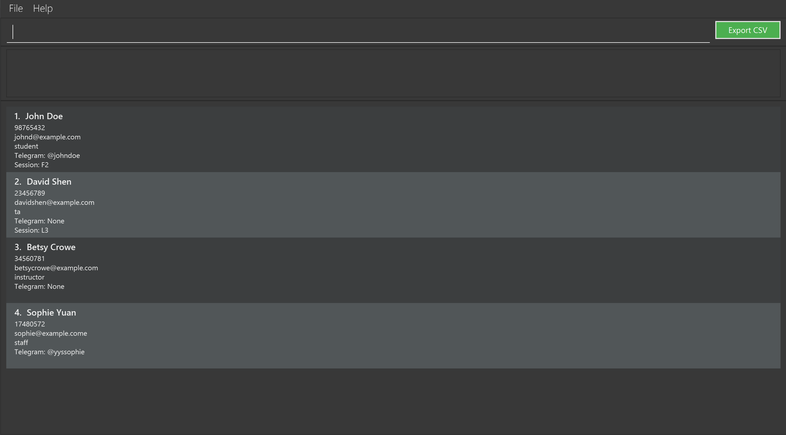
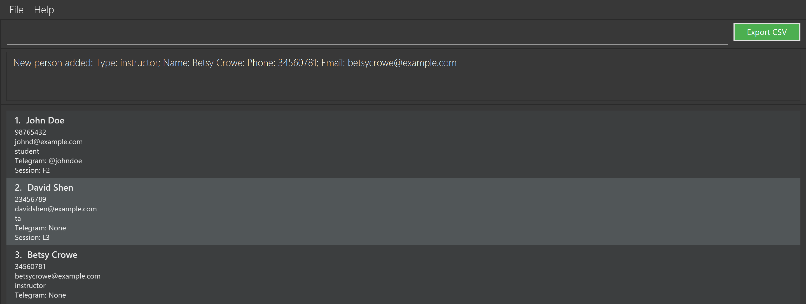
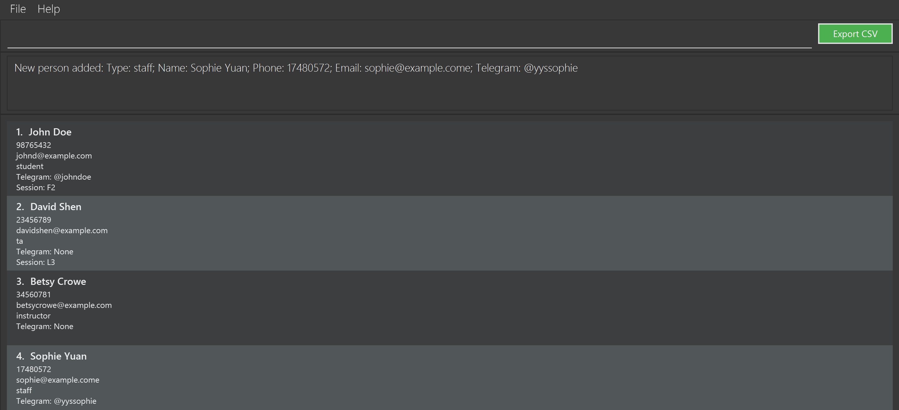

TAConnect is a **desktop app for teaching assistants to manage students, sessions, and communication**, optimized for use via a Command Line Interface (CLI) while still having the benefits of a Graphical User Interface (GUI). If you can type fast, AB3 can get your contact management tasks done faster than traditional GUI apps.

* Table of Contents
{:toc}

--------------------------------------------------------------------------------------------------------------------

## Quick start

1. Ensure you have Java `17` or above installed in your Computer. 
   **Mac users:** Ensure you have the precise JDK version prescribed [here](https://se-education.org/guides/tutorials/javaInstallationMac.html).

1. Download the latest `.jar` file from [here](https://github.com/AY2526S1-CS2103T-F15a-1/tp/releases).

1. Copy the file to the folder you want to use as the _home folder_ for your TAConnect contact list.

1. Open a command terminal, `cd` into the folder you put the jar file in, and use the `java -jar addressbook.jar` command to run the application. 
   A GUI similar to the below should appear in a few seconds. Note how the app contains some sample data. 
   

1. Type the command in the command box and press Enter to execute it. e.g. typing **`help`** and pressing Enter will open the help window. 
   Some example commands you can try:

   * `list` : Lists all contacts.

   * `add n/John Doe p/98765432 e/johnd@example.com t/student u/@johndoe s/F2` : Adds a student contact named `John Doe` to the contact list.

   * `delete 3` : Deletes the 3rd contact shown in the current list.

   * `clear` : Deletes all contacts.

   * `exit` : Exits the app.

1. Refer to the [Features](#features) below for details of each command.

--------------------------------------------------------------------------------------------------------------------

## Features

**:information_source: Notes about the command format:** 

* Words in `UPPER_CASE` are the parameters to be supplied by the user. 
  e.g. in `add n/NAME`, `NAME` is a parameter which can be used as `add n/John Doe`.

* Items in square brackets are optional. 
  e.g `n/NAME [u/TELEGRAM_USERNAME]` can be used as `n/John Doe u/@JohnDoe` or as `n/John Doe`.

* Parameters can be in any order. 
  e.g. if the command specifies `n/NAME p/PHONE_NUMBER`, `p/PHONE_NUMBER n/NAME` is also acceptable.

* Extraneous parameters for commands that do not take in parameters (such as `help`, `list`, `exit` and `clear`) will be ignored. 
  e.g. if the command specifies `help 123`, it will be interpreted as `help`.

* If you are using a PDF version of this document, be careful when copying and pasting commands that span multiple lines as space characters surrounding line-breaks may be omitted when copied over to the application.

### Field Constraints

- Name: Allows letters (no digits), spaces, apostrophes (' or ’), hyphens (-), periods (.), and slashes (/). Examples: O'Connor, D’Angelo, Jean-Luc, J. P. Morgan, Rajesh S/O Raman.
- Phone: Singapore numbers only — exactly 8 digits (0–9). No spaces, symbols, or country codes in this field.
- Email: Must be of the form local-part@domain and adhere to:
  - one and only one '@', no spaces
  - total length ≤ 254; local-part ≤ 64; each domain label ≤ 63
  - local-part uses letters/digits with [._+-] as separators; cannot start/end with a separator; no consecutive dots
  - domain labels separated by '.', each starts/ends alphanumeric; hyphens allowed inside; final label (TLD) ≥ 2
  - domain is case-insensitive; stored in lowercase
- Type and Session: Type must be one of the four inputs, **case-sensitive**: `student`, `ta`, `instructor`, and `staff`
  - `student` and `ta` must have a session, while `instructor` and `staff` should not have any session
- Telegram Username: Optional field, must adhere to:
  - 5 to 32 characters long
  - accepted characters: a-z, A-Z, 0-9 and underscores
  - optionally, include @ as the first character
  - for more details, see the following: https://core.telegram.org/method/account.updateUsername#parameters

### Viewing help : `help`

Shows a message explaining how to access the help page.

Format: `help`

### Adding a person: `add`

Adds a contact to the contact list of TAConnect.

Format: `add n/NAME p/PHONE_NUMBER e/EMAIL t/TYPE [u/TELEGRAM_USERNAME] s/SESSION`

For convenience, a TA can also record telegram username, but it is an optional field.

Examples:
* Add contact type `student`: `add n/John Doe p/98765432 e/johnd@example.com t/student u/@johndoe s/F2`

* Add contact type `ta`: `add n/David Shen p/23456789 e/davidshen@example.com t/ta s/L3`

* Add contact type `instructor`: `add n/Betsy Crowe p/34560781 e/betsycrowe@example.com t/instructor`

* Add contact type `staff`: `add n/Sophie Yuan p/17480572 e/sophie@example.come t/staff u/@yyssophie`

### Listing all contacts : `list`

Displays all contacts currently stored in TAConnect.

Format: `list`

* The list is reset to the full view, clearing any filters applied by previous commands such as `find` or `listsession`.
* Useful when you want to return to the complete contact list after filtering.

Examples:
* `list` — Displays all contacts in TAConnect.

### Listing contacts by session : `listsession`

Shows a list of all persons who belong to the specified session.

Format: `listsession [SESSION]`

* Displays only the contacts whose session field matches the given `SESSION` value.
* Session names are **case-insensitive** and must follow the valid pattern `[A-Z]\d+` (e.g., `F1`, `G2`, `T10`), meaning a single uppercase letter followed by a number from **1 to 99** (without leading zeros)..
* Contacts without a session (e.g., instructors or staff) will not appear in the result.
* Useful for TAs who manage multiple tutorial or lab groups.

Examples:
* `listsession F20` — Lists all contacts in session F20.
* `listsession G1` — Lists all contacts in session G1.

### Exporting the displayed contacts : `export`

Exports the contacts currently shown in the list to a CSV file containing `Name`, `Telegram`, `Email`, `Type`, and `Session`.

Format: `export [FILE_PATH]`

* If no path is provided, TAConnect creates a new file named `contacts-YYYYMMDD-HHMMSS.csv` inside the `exports/` folder (relative to where you launched the app).
* If `FILE_PATH` points to an existing directory (or ends with `/` or `\`), the CSV is written into that directory with the timestamped name shown above.
* If `FILE_PATH` points to a new file, the `.csv` extension is added automatically when missing.
* Only the contacts currently listed are exported. Combine with commands such as `find` to export a filtered subset.

You can trigger the export either by typing the command or by clicking the `Export CSV` button beside the command box. The result display shows the location of the generated file.

### Locating persons by name: `find`

Finds persons whose names contain any of the given keywords.

Format: `find KEYWORD [MORE_KEYWORDS]`

* The search is case-insensitive. e.g `hans` will match `Hans`
* The order of the keywords does not matter. e.g. `Hans Bo` will match `Bo Hans`
* Only the name is searched.
* Only full words will be matched e.g. `Han` will not match `Hans`
* Persons matching at least one keyword will be returned (i.e. `OR` search).
  e.g. `Hans Bo` will return `Hans Gruber`, `Bo Yang`

Examples:
* `find John` returns `john` and `John Doe`
* `find alex david` returns `Alex Yeoh`, `David Li` 
  

### Deleting a person : `delete`
Aliases: `del`, `rm`

Deletes the specified person from the contact list.

Format: `delete INDEX [MORE_INDEXES|RANGE] [n/NAME] [n/MORE_NAMES]`

* Deletes each person at the specified `INDEX` values, any indices in a `RANGE` of the form `A-B` (inclusive),
  or with the exact `NAME` provided.
* The indexes refer to the numbers shown in the displayed person list.
* Every index **must be a positive integer** 1, 2, 3, …​
* Names are case-sensitive and must match the contact name exactly, including spaces.

Examples:
* `list` followed by `delete 2` deletes the 2nd person in the contact list.
* `list` followed by `delete 1 3` deletes both the 1st and 3rd persons in the currently displayed list.
* `delete 2-5` deletes the 2nd to 5th persons shown in the current list (inclusive).
* `delete 1 3-4` deletes the 1st, 3rd, and 4th persons.
* `delete n/Alice Tan` deletes the contact whose name is exactly `Alice Tan`.
* `list` followed by `delete 1 n/Alice Tan` deletes the 1st person in the list and the contact named `Alice Tan`.
* `find Betsy` followed by `delete 1` deletes the 1st person in the results of the `find` command.
* Aliases: `del 2`, `rm n/Alice Tan` behave the same as `delete`.

### Undo last change : `undo`

Undoes the most recent command that modified the contact list (e.g., `add`, `delete`, `clear`). History is kept only for the current session; closing the app clears the undo stack.

Format: `undo`

Examples:
* `add n/John Doe ...` followed by `undo` removes the newly added contact and shows `Undo successful (reverted: add)`.
* `delete 1 3-4` followed by `undo` restores the contacts removed by that delete and reports the exact command alias that was reverted (e.g., `delete`, `del`).

### Command history (↑/↓)

You can navigate your previously entered commands using the **UP** and **DOWN** arrow keys, similar to a terminal.

* **UP:** Shows the previous command in history.
* **DOWN:** Shows the next command in history; if you reach the end, your current unfinished input (buffer) is restored.
* **Duplicates & empty lines:** Empty inputs are not saved. Consecutive identical commands are stored only once.
* **Edits while browsing history:** If you edit the text at any time, those edits are preserved when you return to the end (buffer).

Examples:
1. Type `list` → press Enter. Press ↑ → `list` appears.
2. Type `find alex` → press Enter. Press ↑ twice → `find alex`, then `list`.
3. Press ↑ to view `list`, type `l` to modify it, then press ↓ until the end → your unfinished text appears again (e.g., `l`).

### Clearing all entries : `clear`

Clears all entries from the contact list of TAConnect.

Format: `clear`

### Exiting the program : `exit`

Exits the program.

Format: `exit`

### Saving the data

TAConnect data are saved in the hard disk automatically after any command that changes the data. There is no need to save manually.

### Editing the data file

TAConnect data are saved automatically as a JSON file `[JAR file location]/data/addressbook.json`. Advanced users are welcome to update data directly by editing that data file.

:exclamation: **Caution:**
If your changes to the data file makes its format invalid, TAConnect will discard all data and start with an empty data file at the next run. Hence, it is recommended to take a backup of the file before editing it. 
Furthermore, certain edits can cause the TAConnect to behave in unexpected ways (e.g., if a value entered is outside of the acceptable range). Therefore, edit the data file only if you are confident that you can update it correctly.

### Archiving data files `[coming in v2.0]`

_Details coming soon ..._

--------------------------------------------------------------------------------------------------------------------

## FAQ

**Q**: How do I transfer my data to another Computer? 
**A**: Install the app in the other computer and overwrite the empty data file it creates with the file that contains the data of your previous TAConnect home folder.

--------------------------------------------------------------------------------------------------------------------

## Known issues

1. **When using multiple screens**, if you move the application to a secondary screen, and later switch to using only the primary screen, the GUI will open off-screen. The remedy is to delete the `preferences.json` file created by the application before running the application again.
2. **If you minimize the Help Window** and then run the `help` command (or use the `Help` menu, or the keyboard shortcut `F1`) again, the original Help Window will remain minimized, and no new Help Window will appear. The remedy is to manually restore the minimized Help Window.

--------------------------------------------------------------------------------------------------------------------

## Command summary

Action | Format, Examples
--------|------------------
**Add student** | `add n/NAME p/PHONE_NUMBER e/EMAIL t/student [u/TELEGRAM_USERNAME] s/SESSION`   e.g., `add n/John Doe p/98765432 e/johnd@example.com t/student u/@johndoe s/F2`
**Add ta** | `add n/NAME p/PHONE_NUMBER e/EMAIL t/ta [u/TELEGRAM_USERNAME] s/SESSION`   e.g., `add n/David Shen p/23456789 e/davidshen@example.com t/ta s/L3`
**Add instructor** | `add n/NAME p/PHONE_NUMBER e/EMAIL t/instructor [u/TELEGRAM_USERNAME]`   e.g., `add n/Betsy Crowe p/34560781 e/betsycrowe@example.com t/instructor`
**Add staff** | `add n/NAME p/PHONE_NUMBER e/EMAIL t/staff [u/TELEGRAM_USERNAME]`   e.g., `add n/Sophie Yuan p/17480572 e/sophie@example.come t/staff u/@yyssophie`
**Clear** | `clear`
**Delete** | `delete|del|rm INDEX [MORE_INDEXES] [n/NAME] [n/MORE_NAMES]`  e.g., `delete 3`, `del 1 4`, `rm n/Alice Tan`
**Find** | `find KEYWORD [MORE_KEYWORDS]`  e.g., `find James Jake`
**List** | `list`
**List session** | `listsession [SESSION]`   e.g., `listsession F20`
**Undo** | `undo`
**Export** | `export [FILE_PATH]`  e.g., `export`, `export exports/tutorial-group.csv`
**Help** | `help`
**Exit** | `exit`
